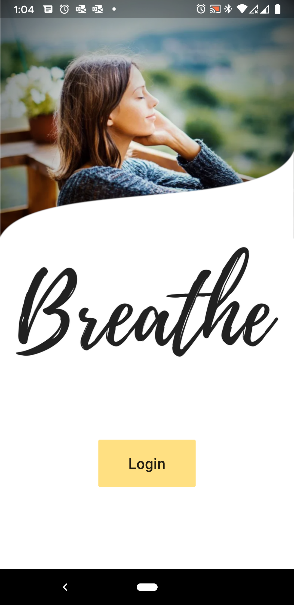
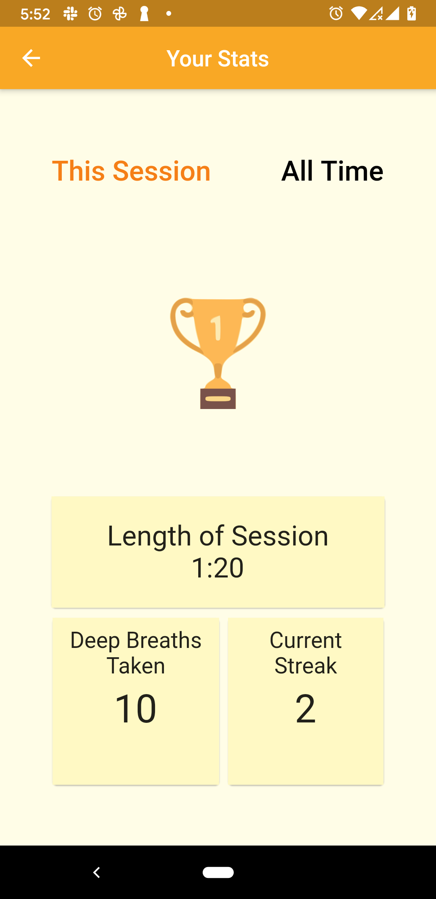

# Breathe

A guided breathing meditation app built in flutter for [#HACK2020](https://flutterhackathon.com/#/) 

Authors:  
- Nolan Sherman [LinkedIn](https://www.linkedin.com/in/nolanrsherman)
- Tateyana Hendricks [Email](Thendricks25@gmail.com)

## Pitch:
Simply Breathe! Press play, you breathe, you leave. During this worldwide pandemic, many people are feeling the weight of the chaos on their shoulders. Breathe is here to help you take a moment to relax and center yourself with controlled breathing.

## Additional information / motivation:

### Problem: 
The pandemic brought with it many sudden changes to everyday life. Understandably these changes have left people experiencing negative feelings like anxiety, anger, fear, etc. You can even feel all these things at once which can be overwhelming and leave you feeling out of control. 

### Solution: 
Studies have shown that breathing meditation can be effective in decreasing stress. Our app leads the user through a simple deep breathing exercise that can last for as long as they need. 
### Why care?: 
No one likes to experience negative feelings and they can get in the way of you being productive and being able to help other people. So we need to take a moment and help ourselves before we can help someone else. We can save the world by saving ourselves first.   When you are able to use deep breathing to get your emotions under control you can make better decisions and lead a more productive life. 

## Tags (comma delimited): 
meditation, save the world, people, mental health, animation

## Pitch Video:  

## Screnshots

